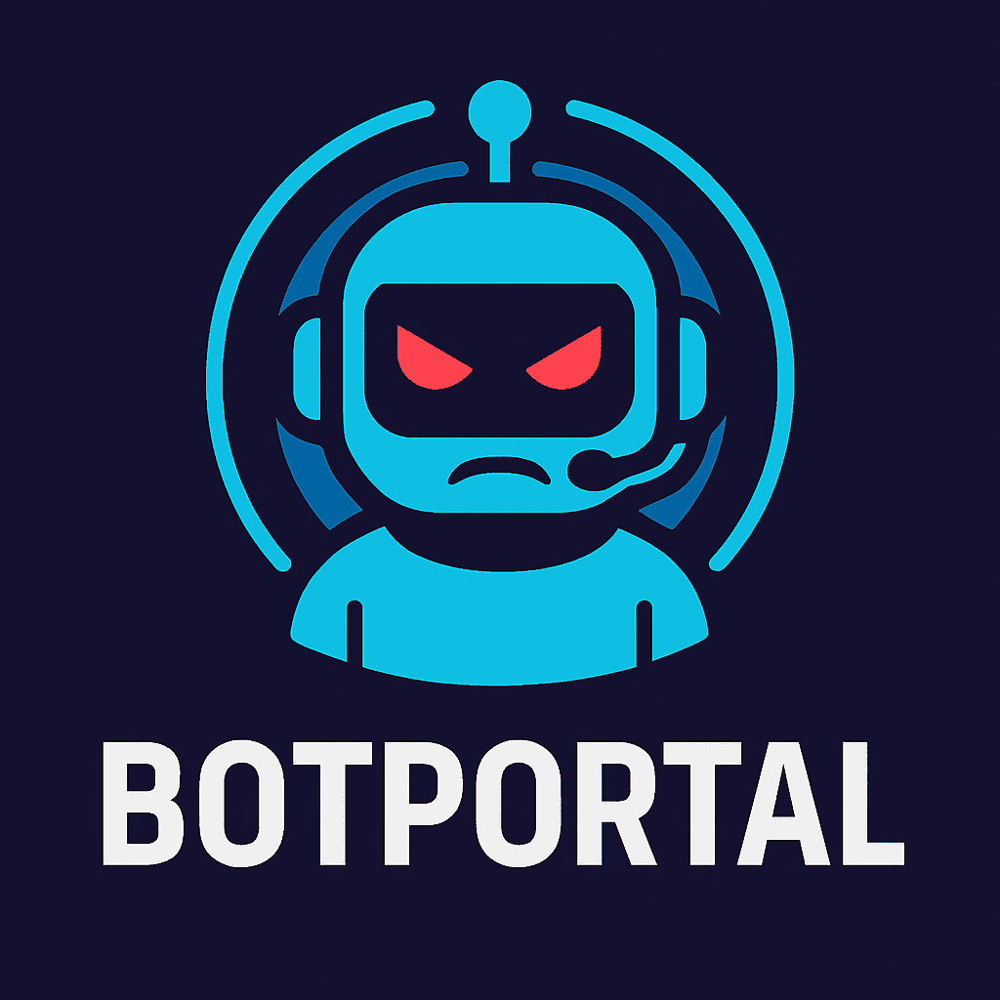
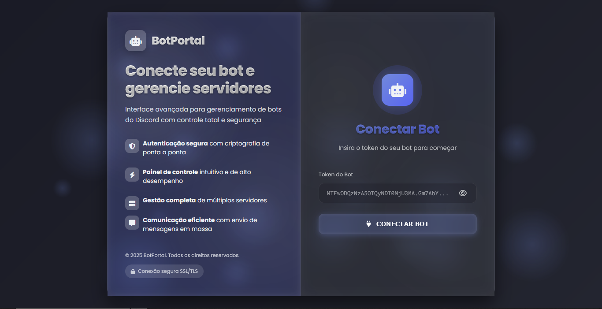

# BotPortal - Ferramenta de Gerenciamento de Bots Discord 🚀



BotPortal é uma poderosa ferramenta web para gerenciar e operar bots Discord com interface intuitiva e funcionalidades avançadas de envio de mensagens.

## ✨ Recursos Principais
- ✅ Interface web amigável
- 📊 Estatísticas detalhadas de servidores
- ✉️ Envio em massa de mensagens DM
- ⚡ Controle total sobre envios
- 📈 Relatórios de desempenho em tempo real

## 🛠 Pré-requisitos
Antes de começar, você precisa ter instalado:
- Python 3.8 ou superior
- Pip (gerenciador de pacotes Python)
- Git (para clonar o repositório)

## 📥 Instalação e Configuração

### 1. Clonar o repositório
```bash
git clone https://github.com/lalaio1/BotPortal.git
cd BotPortal
```

### 2. Instalar dependências
```bash
pip install -r requirements.txt
```

### 2. Iniciar
```bash
python app.py
```


### 4. Executar o BotPortal
```bash
python main.py
```

### 5. Acessar a interface
Abra seu navegador e visite:
```
http://localhost:5000
```

## 🖥 Interface de Usuário



---


## 🚀 Como Usar
1. **Login com Token do Bot**
   - Insira o token do seu bot Discord
   - Aguarde a conexão ser estabelecida

2. **Selecionar Servidor**
   - Escolha um servidor da lista
   - Analise as estatísticas detalhadas

3. **Enviar Mensagens**
   - Digite sua mensagem personalizada


## ⚠️ Importante
- Sempre respeite os Termos de Serviço do Discord
- Use esta ferramenta com responsabilidade
- Não envie spam para usuários

## 👥 Suporte
Dúvidas ou problemas? Contate:
- GitHub: [github.com/lalaio1](https://github.com/lalaio1)
- Telegram: [t.me/lalaio1](https://t.me/lalaio1)

---

Desenvolvido com ❤️ por [lalaio1](https://github.com/lalaio1)  
⭐ Deixe sua estrela no [GitHub](https://github.com/lalaio1/BotPortal)
